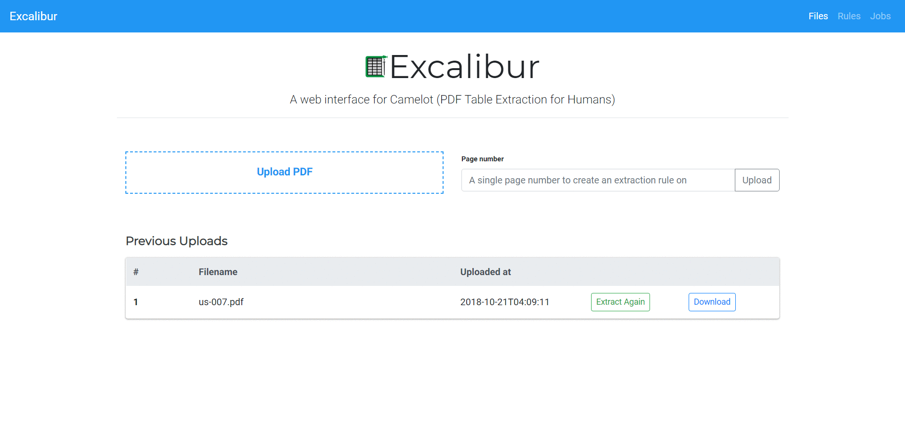

.. Excalibur documentation master file, created by
   sphinx-quickstart on Tue Oct 16 18:31:41 2018.
   You can adapt this file completely to your liking, but it should at least
   contain the root `toctree` directive.

Excalibur: PDF Table Extraction for Humans
==========================================

Release v\ |version|. (:ref:`Installation <install>`)

.. image:: https://readthedocs.org/projects/excalibur-py/badge/?version=master
    :target: https://excalibur-py.readthedocs.io/en/master/
    :alt: Documentation Status

.. image:: https://img.shields.io/pypi/v/excalibur-py.svg
    :target: https://pypi.org/project/excalibur-py/

.. image:: https://img.shields.io/pypi/l/excalibur-py.svg
    :target: https://pypi.org/project/excalibur-py/

.. image:: https://img.shields.io/pypi/pyversions/excalibur-py.svg
    :target: https://pypi.org/project/excalibur-py/

.. image:: https://badges.gitter.im/camelot-dev/Lobby.png
    :target: https://gitter.im/camelot-dev/Lobby

**Excalibur** is a web interface to extract tabular data from PDFs, written in **Python 3**! It powered by `Camelot <https://camelot-py.readthedocs.io/>`_.

.. note:: Excalibur only works with text-based PDFs and not scanned documents. (As Tabula `explains`_, "If you can click and drag to select text in your table in a PDF viewer, then your PDF is text-based".)

.. _explains: https://github.com/tabulapdf/tabula#why-tabula

Using Excalibur
---------------

**Note:** You need to `install ghostscript <https://camelot-py.readthedocs.io/en/master/user/install-deps.html>`_ before moving forward.

After :ref:`installing Excalibur with pip <install>` (), you can initialize the metadata database using::

    $ excalibur initdb

And then start the webserver using::

    $ excalibur webserver

That's it! Now you can go to http://localhost:5000 and start extracting tabular data from your PDFs.

1. **Upload** a PDF and enter the page numbers you want to extract tables from.

2. Go to each page and select the table by drawing a box around it. (You can choose to skip this step since Excalibur can automatically detect tables on its own. Click on "**Autodetect tables**" to see what Excalibur sees.)

3. Choose a flavor (Lattice or Stream) from "**Advanced**".

    a. **Lattice**: For tables formed with lines.

    b. **Stream**: For tables formed with whitespaces.

4. Click on "**View and download data**" to see the extracted tables.

5. Select your favorite format (CSV/Excel/JSON/HTML) and click on "**Download**"!

.. note:: You can also download executables for Windows and Linux from the `releases page`_ and run them directly!

.. _releases page: https://github.com/camelot-dev/excalibur/releases

Why Excalibur?
--------------

- Extracting tables from PDFs is hard. A simple copy-and-paste from a PDF into an Excel doesn't preserve table structure. **Excalibur makes PDF table extraction very easy**, by automatically detecting tables in PDFs and letting you save them into CSVs and Excels.
- Excalibur uses `Camelot <https://camelot-py.readthedocs.io/>`_ under the hood, which gives you additional settings to tweak table extraction and get the best results. You can see how it performs better than other open-source tools and libraries `in this comparison`_.
- You can save table extraction :ref:`settings <faq>` (like table areas) for a PDF once, and apply them on new PDFs to extract tables with similar structures.
- You get complete control over your data. All file storage and processing happens on your own local or remote machine.
- Excalibur can be configured with MySQL and Celery for parallel and distributed workloads. By default, sqlite and multiprocessing are used for sequential workloads.

.. _in this comparison: https://github.com/socialcopsdev/camelot/wiki/Comparison-with-other-PDF-Table-Extraction-libraries-and-tools

Support us on OpenCollective
----------------------------

If Excalibur helped you extract tables from PDFs, please consider supporting its development by `becoming a backer or a sponsor on OpenCollective`_!

.. _becoming a backer or a sponsor on OpenCollective: https://opencollective.com/excalibur

The User Guide
--------------

This part of the documentation focuses on instructions to get you up and running with Excalibur.

.. toctree::
   :maxdepth: 2

   user/intro
   user/install
   user/howto
   user/usage
   user/faq

The Contributor Guide
---------------------

If you want to contribute to the project, this part of the documentation is for
you.

.. toctree::
   :maxdepth: 2

   dev/contributing
