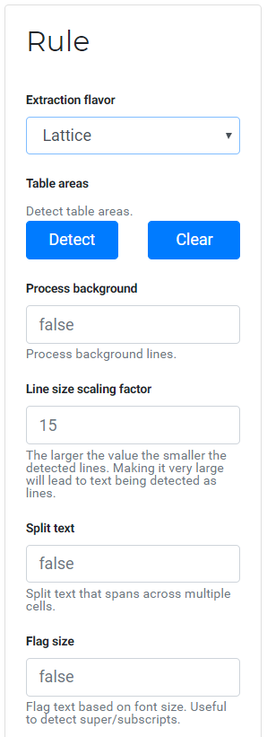

.. _concepts:

Concepts
========

This part of the documentation explains some core ideas used inside Excalibur.

Rule
----

A table extraction rule contains a set of parameters which Camelot can use to extract table from PDFs. Camelot contains two table parsing flavors, Stream and Lattice, each having a set of configuration parameters.

.. note:: The names for Camelot parsing flavors were inspired from Tabula and the concept of a table extraction rule inside Excalibur was inspired from Docparser.

You can check out Camelot's `read_pdf`_ interface to see a list of all configuration parameters.

.. _read_pdf: https://camelot-py.readthedocs.io/en/master/api.html#main-interface

**Examples**:

- Lattice with `line_size_scaling=40` is a rule.
- Stream with a `table_area` and `columns` is a rule.

Inside Excalibur, a rule can be specified by selecting a flavor and its corresponding options in the rule box on the workspace. (As shown on the right)

From *v0.2.0*, you will be able to give each rule a name and save them as a preset for use on different PDFs to extract tables with similar structures.

Job
---

When you create a rule and apply it on a PDF, a table extraction job is created.

From *v0.2.0*, you will be able to apply a rule on multiple PDFs at once.

----

To know more about how Camelot works, check out its `how it works`_ documentation.

.. _how it works: https://camelot-py.readthedocs.io/en/master/user/how-it-works.html
