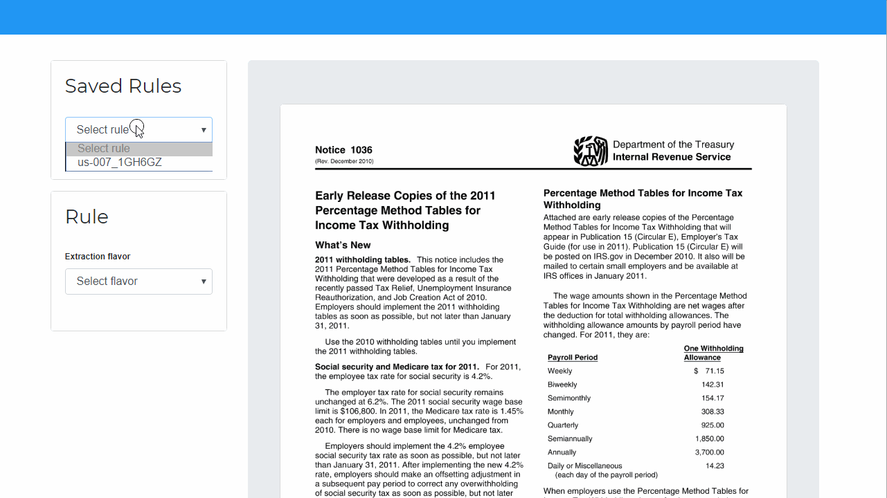

.. _faq:

FAQ
===

This part of the documentation answers some common questions. If you want to add a question (with or without an answer), you can `open an issue`_ on GitHub or submit a pull request which updates this file.

.. _open an issue: https://github.com/camelot-dev/excalibur/issues/new

What is a workspace?
--------------------

.. image:: ../_static/screenshots/workspace.png
    :scale: 40%
    :align: center

A workspace is the part of the web interface where you can select table areas, add columns and tweak Camelot's `advanced settings <https://camelot-py.readthedocs.io/en/master/user/advanced.html>`_.

What are rules?
---------------

For a PDF document, a set of table areas, columns and Camelot's `advanced settings <https://camelot-py.readthedocs.io/en/master/user/advanced.html>`_ which you select form a table extraction rule.

Excalibur contains a rule manager where you can download saved rules and upload rules that you might have created on other Excalibur installations. To view all existing rules, click on "Rules" in the navigation bar on top.

While on the workspace, you can select a saved rule by clicking on the "Select saved rule" dropdown. After you click on a saved rule, the table areas, columns and Camelot settings contained in that rule will be loaded on the workspace.

What are jobs?
--------------

When you click on "View and Download Data" on the workspace, Excalibur starts a table extraction job using the settings you specified. You can view a list of all historical jobs by clicking on "Jobs" in the navigation bar on top.

To view and download the tables extracted in an older job, click on the "Download" button for that job.
