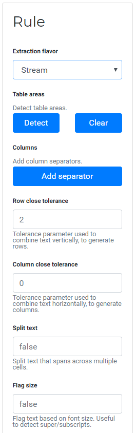

.. _usage:

Usage with screenshots
======================

This part of the documentation demonstrates usage of the web interface.

A table extraction workflow on Excalibur can be broken down into three simple steps.

Upload file
-----------

When you open http://localhost:5000, you will see the following screen.

.. image:: ../_static/screenshots/upload.png
    :scale: 40%
    :align: center

This is the upload view where you can upload a PDF, select a page number to create a table extraction *rule* on and click "Upload".

You can also see previously uploaded PDFs, extract tables from them by creating a different *rule* using "Extract Again" or download the data tables for the most recent *job* associated with that PDF by clicking on "Download".

Create table extraction rule
----------------------------

Clicking on "Upload" or "Extract Again" will take you to the *workspace* for a PDF.

.. image:: ../_static/screenshots/workspace.png
    :scale: 40%
    :align: center

Here you can create a table extraction rule on the PDF page number you selected, and apply it on that same or multiple pages of the PDF. Let's create an extraction rule on a `PDF`_.

.. _PDF: https://github.com/socialcopsdev/camelot/blob/master/tests/files/tabula/us-007.pdf

Since the table has no lines, you should use the Stream flavor.

As the table is located in a small part of the page, you need to select the table area.

.. image:: ../_static/screenshots/stream/table_area.png
    :scale: 40%
    :align: center

Optionally, you can also select a column separator by clicking on "Add Separator" inside the Stream Rule box.

.. note:: Double-clicking on a column separator will delete it.

.. image:: ../_static/screenshots/stream/column.png
    :scale: 40%
    :align: center

Finally, you can click on "Extract" to start a table extraction *job*.

.. note:: The Lattice flavor for tables with lines doesn't have a "Add Separator" button. It also doesn't need a table area (though you can specify it) since it reliably detects table boundaries and column separators on its own. In most cases, you won't need to tweak any of its configuration options.

Download file
-------------

Clicking on "Extract" will take you to the following screen. Here you can preview all the extracted tables and download them in CSV, Excel, JSON or HTML formats.

.. image:: ../_static/screenshots/stream/extracted_data.png
    :scale: 40%
    :align: center
