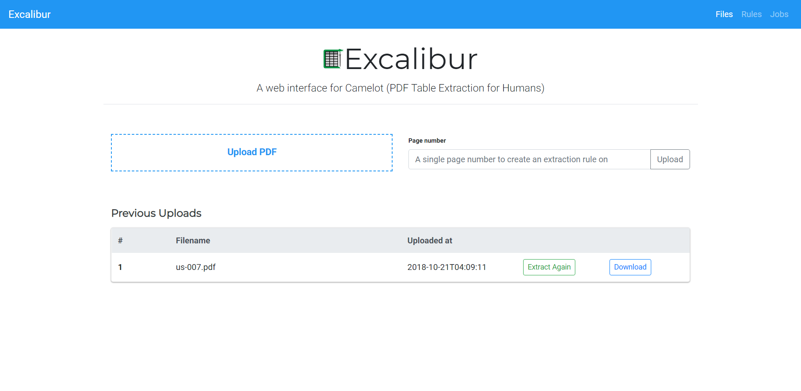
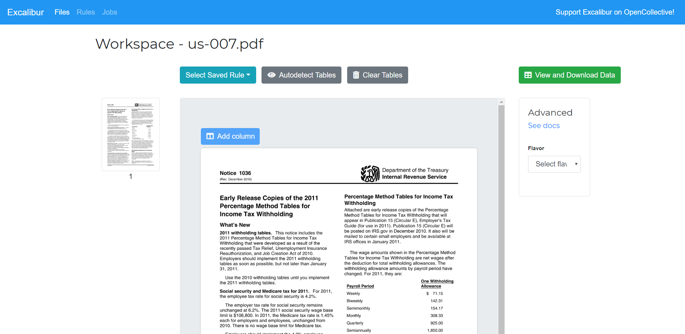
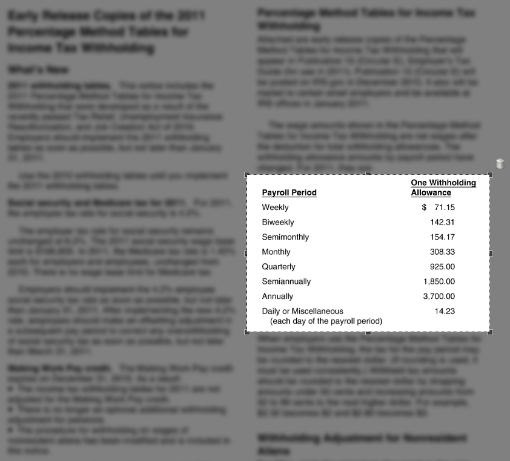
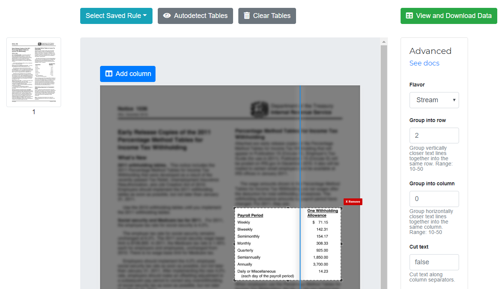
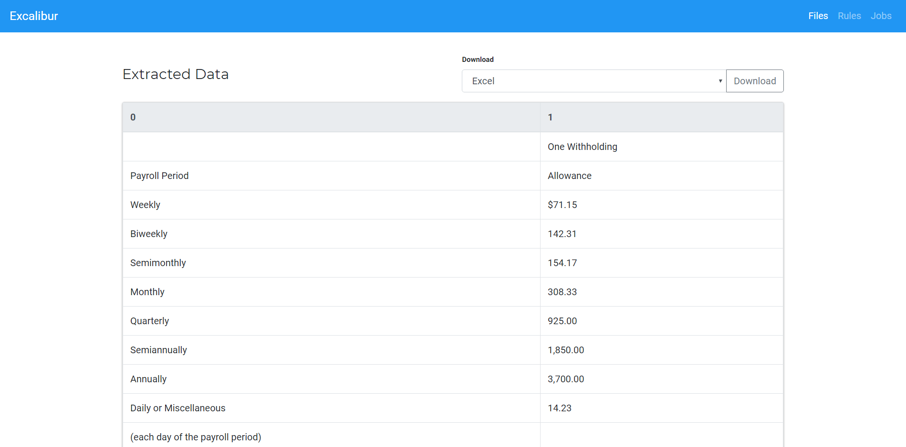

.. _usage:

Usage with screenshots
======================

This part of the documentation demonstrates usage of the web interface.

A table extraction workflow on Excalibur can be broken down into three simple steps.

Upload a PDF
------------

When you open http://localhost:5000, you will see the following screen.

This is where you upload a PDF, select page numbers you want to extract tables from and click on "Upload".

You can also see previously uploaded PDFs, extract tables from them again by clicking on "Extract Again" or download tables that were extracted last time by clicking on "Download".

Select table areas and other settings
-------------------------------------

Clicking on "Upload" or "Extract Again" will take you to a **Workspace**.

Here you can select table areas by clicking and dragging across a PDF page's image. You can also tweak Camelot's `advanced settings`_. Let's extract the table from this `PDF file`_ as an example:

.. _advanced settings: https://camelot-py.readthedocs.io/en/master/user/advanced.html
.. _PDF file: https://github.com/socialcopsdev/camelot/blob/master/tests/files/tabula/us-007.pdf

.. note:: This is a worst-case example where the table is buried deep inside the text. In most cases, you don't need to select table areas, columns or change the advanced settings since Excalibur can do that automatically. You can click on "Autodetect tables" to see what table areas Excalibur detected.

Since the table is formed using whitespaces, you need to select the **Stream** flavor from "**Advanced**". You also need to select a table area in this case for the reason mentioned in the note above.

Optionally, you can also add a column on a page by clicking on "Add column" button.

.. note:: To delete a column, double-click on it.

.. note:: The Lattice flavor doesn't need columns so the "Add column" button will be disabled when you select that flavor.

Finally, you can click on "View and Download Data". This will save the table areas, columns and advanced settings as a preset which can be used in the future on PDFs with similar table structures.

View and download data
----------------------

Now you can view all the extracted tables and download them in CSV, Excel, JSON or HTML formats.

----

To know more about how **Lattice** and **Stream** work, check out Camelot's `how it works`_ documentation.

.. _how it works: https://camelot-py.readthedocs.io/en/master/user/how-it-works.html
